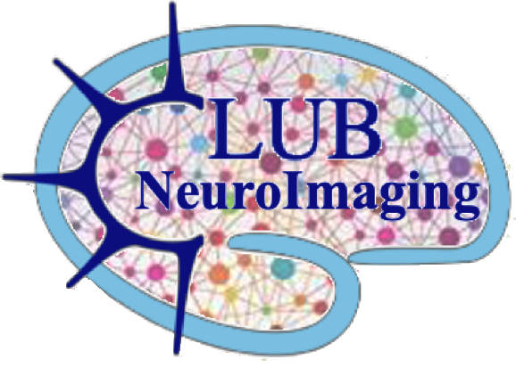

# NeuroImaging

[Next meetings](next-meetings.md) · [Past meetings](Pas-meetings.md) · [Ressources](ressources.md)

---

Welcome on the website of the CRNL NeuroImaging Club!

Monthly meetings of neuroscientists who use or want to use neuroImaging tools. It's a club organised and hosted at the [CRNL](https://www.crnl.fr/) and open to everyone who wants to join and discuss.

Archives of the presentations 2019 to 2026: [OSF](https://osf.io/sxkgq/overview)
