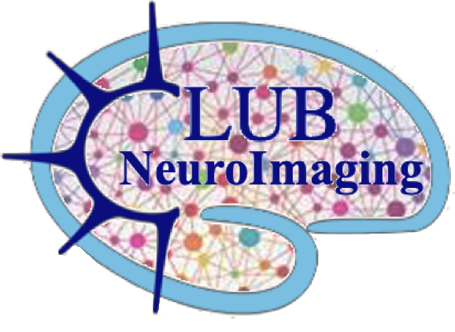

[Accueil](index.md) · [Next meetings](next-meetings.md) · [Old meetings](old-meetings.md) · [Ressources](ressources.md)

---

# Old meetings

Liste des réunions passées et présentations associées (PDF / PPT téléchargeables).

- **26/09/26** — feedback from the OHBM 2026 conference, REMI’s network 10th anniversary, choosing a new website for the Club & sharing useful resources for the Club (e.g. Elements of fMRI analysis by Tor Wager) — [PDF](presentations/2026_09_club_NeuImg_65_v1.pdf)

older meetings : [OSF](https://osf.io/sxkgq/overview)

even older : [wiki CRNL](https://wiki.crnl.fr/doku.php?id=wiki:services_et_groupes:club_neuro_imageurs:club_neuro_imagerie) accessible uniquement aux membres du CRNL

